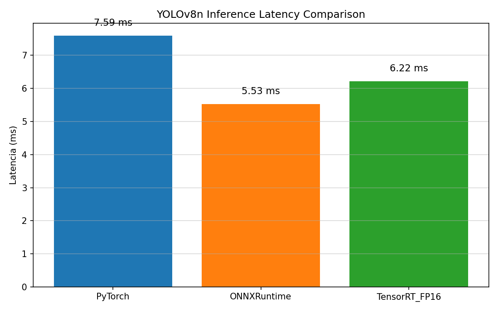

<!-- ============================================================
Copyright (c) 2026 FutureDriver
SPDX-License-Identifier: MIT

文件：README.md
功能：项目说明文档
作者：FutureDriver
日期：2026-06-17
============================================================ -->

# YOLOv8n TensorRT C++ 高性能部署 Demo

> 从 ONNX 导出到 C++ TensorRT 推理的完整工程实践，展示 RAII 资源管理、异步 CUDA 流、移动语义等现代 C++ 最佳实践。

## 📊 性能概览

| 框架 | 平均延迟 | P95 延迟 | 吞吐量 (FPS) | 相对 PyTorch 提升 |
|------|----------|----------|--------------|-------------------|
| Python PyTorch (Baseline) | 9.89 ms | - | 101.1 | — |
| Python ONNX Runtime | 6.40 ms | - | 156.3 | -35.3% |
| C++ TensorRT FP16 (初始) | 6.22 ms | 6.94 ms | 160.9 | -37.1% |
| C++ TensorRT + CUDA 预处理 | 4.50 ms | 5.24 ms | 222.0 | -54.5% |
| **C++ TensorRT + 端到端检测** | **4.07 ms** | **5.83 ms** | **245.4** | **-58.8%** |




> **阶段耗时分解**（Profile 100次平均，最近一次实测）：
> - 预处理 (GPU)：1.65 ms
> - 推理 (GPU，含NMS)：2.78 ms
> - 后处理 (CPU)：0.053 ms
> - **1000次基准平均总延迟：4.07 ms**（相对PyTorch基线9.89ms降低 **58.8%**）
>
> NMS已移入TensorRT引擎，后处理仅需简单结果拷贝。
> 因GPU温度与系统负载影响，每次运行数据有正常波动（历史最优3.98ms）。
> 下一步可通过CUDA Graph或INT8量化进一步降低推理延迟。

## 🚀 快速开始

### 环境要求
- NVIDIA GPU（GTX 1060 6GB+，推荐 RTX 3060+）
- Docker + NVIDIA Container Toolkit
- 约 20 GB 磁盘空间

### 一键运行
```bash
git clone https://github.com/FutureDriver/yolo_tensorrt_demo.git
cd yolo_tensorrt_demo
chmod +x run_demo.sh
./run_demo.sh
```

脚本会自动完成：
1. 拉取预构建的 Docker 环境镜像（约 8 GB，首次需几分钟）
2. 导出带 EfficientNMS 的 ONNX 模型（如不存在）
3. 编译 C++ 代码
4. 构建 TensorRT 引擎
5. 运行 Python 基线测试
6. 运行 C++ 基准测试
7. 生成性能对比图

测试结果保存在 `results/` 目录下。

### 手动编译（可选）

如果需要手动编译，可以进入容器后执行：

```bash
mkdir -p build && cd build
cmake .. -DCMAKE_BUILD_TYPE=Release
make -j$(nproc)
./benchmark
```

## 🔧 技术要点
- **RAII 资源管理**：所有 CUDA 资源（Runtime、Engine、Context、CUDA Stream、GPU 显存）均用 `std::unique_ptr` + 自定义 Deleter 封装，零裸指针，确保异常安全。
- **移动语义**：推理类禁止拷贝，实现 `noexcept` 移动构造函数/赋值运算符。
- **异步 CUDA 流**：预处理、推理、后处理在独立 CUDA Stream 上异步执行，通过 `cudaStreamSynchronize` 精确控制同步点。
- **GPU 预处理**：使用 NPP 库进行图像 resize，自定义 CUDA kernel 完成 BGR→RGB、归一化、HWC→CHW 转换，预处理仅 1.6 ms。
- **FP16 量化**：TensorRT 构建时开启 FP16 模式，大幅降低显存占用与推理延迟。
- **端到端检测**：通过 `initLibNvInferPlugins` 注册 EfficientNMS 插件，将 NMS 合并进 TensorRT 引擎，后处理降至 **0.045 ms**。
- **编译期优化**：`constexpr`、`std::string_view`、C++17 `if` 初始化等现代特性。
- **一键复现**：提供 `Dockerfile` + `run_demo.sh`，基于 GitHub Container Registry 托管预构建环境镜像，保证环境一致性。

## 📁 项目结构
```
.
├── CMakeLists.txt          # CMake 构建配置（含 CUDA 支持）
├── Dockerfile              # Docker 环境构建文件
├── run_demo.sh             # 一键运行脚本
├── LICENSE
├── README.md
├── include/
│   └── yolo_infer.hpp      # 推理类声明
├── src/
│   ├── build_engine.cpp    # TensorRT 引擎构建工具（支持 FP16/INT8）
│   ├── yolo_infer.cpp      # 推理类实现
│   ├── preprocess.cu       # GPU 预处理（NPP resize + CUDA kernel）
│   ├── main.cpp            # 快速演示程序
│   └── benchmark.cpp       # 性能基准测试（自动对比 Python 基线）
├── scripts/
│   ├── baseline_benchmark.py  # Python 基线测试
│   ├── export_onnx.py         # 导出 ONNX
│   ├── plot_comparison.py     # 性能对比绘图（柱状图 + 降低百分比）
│   └── verify_onnx.py         # ONNX 模型验证
├── data/
│   └── demo.jpg            # 测试图片
├── models/                 # 模型文件（yolov8n.pt 已提交）
├── results/                # 测试结果 CSV 及性能图（历史快照已提交）
└── build/                  # 编译中间文件（不提交 Git）
```

## 📝 优化路线图
### 推理性能优化
- [✓] **预处理 CUDA 化**：使用 NPP resize + CUDA kernel 完成缩放与颜色转换，预处理延迟从 2.6ms 降至 1.3ms。
- [✓] **后处理 GPU 化**：通过 EfficientNMS 插件实现端到端检测，后处理从 2.3ms 降至 55us。
- [~] **INT8 量化**：校准器与构建逻辑已完成，因 WSL2 环境限制待原生 Linux / Jetson 上验证。
- [ ] **CUDA Graph**：将推理循环录制成 CUDA Graph，消除 kernel 启动开销。
- [ ] **双缓冲流水线**：多流并行，提升连续帧吞吐量。

### 感知-决策闭环（当前优先）
- [ ] **ROS2 节点封装**：将 YOLOInfer 封装为 ROS2 Node，订阅图像话题，发布检测结果。
- [ ] **Behavior Tree 决策**：使用 BT.CPP 实现感知-决策链路，根据检测结果切换机器人行为。

## 📄 许可证
MIT License
